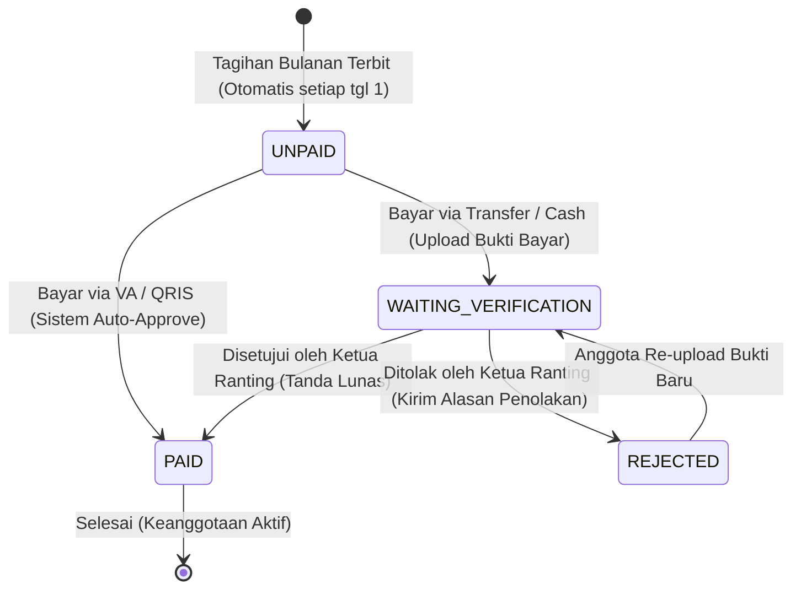

# Spesifikasi Wireframe Premium: Iuran Bulanan Anggota & Verifikasi Ketua Ranting

Dokumen ini merinci arsitektur, antarmuka (wireframe), logika bisnis, dan sistem filter untuk modul **Iuran Bulanan Khusus Anggota** dan portal **Verifikasi Pembayaran oleh Ketua Ranting (Dojo)** pada ekosistem aplikasi INKAI.

---

## 1. Arsitektur Data (Prisma DB Schema)

Untuk mendukung penagihan bulanan yang fleksibel, pencatatan bukti transfer, dan alur persetujuan tingkat Ranting, model database dirancang sebagai berikut:

```prisma
// Penambahan model / perluasan model pada schema.prisma

enum BillingType {
  MONTHLY_IURAN
  EVENT_FEE
  INVENTORY_ORDER
}

enum BillingStatus {
  UNPAID                 // Belum dibayar oleh anggota
  WAITING_VERIFICATION   // Bukti transfer sudah diunggah, menunggu konfirmasi Ketua Ranting
  PAID                   // Lunas (Terverifikasi secara otomatis via VA/QRIS atau manual oleh Ketua Ranting)
  REJECTED               // Bukti bayar ditolak oleh Ketua Ranting
}

enum PaymentMethod {
  VA          // Virtual Account (Instan & Auto-verified)
  QRIS        // E-Wallet (Instan & Auto-verified)
  TRANSFER    // Transfer Bank Manual (Butuh Upload & Verifikasi Ketua Ranting)
  CASH        // Tunai langsung diserahkan ke Dojo (Butuh Verifikasi Ketua Ranting)
}

model Billing {
  id              String         @id @default(uuid())
  memberId        String         // Menghubungkan ke tabel Member/User
  member          User           @relation("MemberBillings", fields: [memberId], references: [id], onDelete: Cascade)
  
  type            BillingType    @default(MONTHLY_IURAN)
  description     String         // Contoh: "Iuran Bulanan - Mei 2026"
  amount          Decimal        @db.Decimal(10, 2)
  dueDate         DateTime
  status          BillingStatus  @default(UNPAID)
  
  // Informasi Pembayaran
  paymentMethod   PaymentMethod?
  payDate         DateTime?      // Tanggal ketika anggota melakukan pembayaran / unggah bukti
  proofUrl        String?        // URL file bukti transfer bank (disimpan di S3/Supabase Storage)
  notes           String?        // Catatan dari anggota saat bayar
  
  // Alur Konfirmasi Ranting (Dojo)
  verifiedById    String?        // ID User Ketua Ranting / Pengurus Ranting yang melakukan verifikasi
  verifiedBy      User?          @relation("VerifiedBillings", fields: [verifiedById], references: [id])
  verifiedAt      DateTime?
  rejectReason    String?        // Alasan penolakan jika status REJECTED
  
  createdAt       DateTime       @default(now())
  updatedAt       DateTime       @updatedAt

  @@index([memberId])
  @@index([status])
}
```

---

## 2. Alur Status & Logika Verifikasi (State Machine)

Berikut adalah diagram alur penanganan iuran bulanan dari terbitnya tagihan hingga dinyatakan lunas:



---

## 3. Wireframe Antarmuka Anggota (Mobile Web UI)

Antarmuka berfokus pada kemudahan akses tagihan aktif, visualisasi opsi pembayaran, penyediaan dropzone unggah bukti yang responsif, serta pencarian riwayat yang ringkas.

### 3.1 Halaman Detail Iuran Bulanan (Member View)
```text
+---------------------------------------+
|  < Kembali         IURAN ANGGOTA      |
|---------------------------------------|
|  [Profil Pic] Budi Santoso            |
|  NIA : 19284820                       |
|  Dojo: Dojo Pusat Jakarta (Ranting 01)|
|---------------------------------------|
|  RINGKASAN TAGIHAN:                   |
|  +---------------------------------+  |
|  | Total Tunggakan (1 Bulan):      |  |
|  | Rp 50.000                       |  |
|  |                                 |  |
|  | [🔒] Konfirmasi Verifikasi Oleh:|  |
|  | Sensei Budi (Ketua Ranting)     |  |
|  +---------------------------------+  |
|  [      BAYAR SEKARANG / LAPOR      ]  |
|                                       |
|  RIWAYAT PEMBAYARAN:                  |
|  [🔍 Cari bulan/tahun...          ]   |
|  Tahun: [ 2026 v ] Bulan: [ Semua v ] |
|  Tabs: [*Semua*] [Lunas] [Tinjau] [Belum]|
|                                       |
|  - Mei 2026 ....... Rp 50.000 [TINJAU] |
|    *Menunggu konfirmasi Ranting       |
|                                       |
|  - April 2026 ..... Rp 50.000 [LUNAS]  |
|    *Lunas via Transfer - 28 Apr 2026  |
|                                       |
|  - Maret 2026 ..... Rp 50.000 [LUNAS]  |
|    *Lunas via Tunai - 12 Mar 2026     |
|                                       |
|=======================================|
| [Home]  [Event] *[Iuran]*  [Profil]   |
+---------------------------------------+
```

### 3.2 Bottom Sheet Pilihan Pembayaran & Form Upload Bukti
```text
+---------------------------------------+
|                 [===]                 |
|  Pilih Pembayaran Iuran               |
|---------------------------------------|
|  Tagihan Terpilih:                    |
|  [X] Iuran Juni 2026 ..... Rp 50.000  |
|                                       |
|  METODE PEMBAYARAN:                   |
|  ( ) Virtual Account (Otomatis)       |
|  ( ) QRIS / E-Wallet (Otomatis)       |
|  (●) Transfer Manual (Verif Ranting)  |
|  ( ) Tunai ke Dojo (Verif Ranting)    |
|---------------------------------------|
|  PANEL TRANSFER MANUAL:               |
|  Rekening Bendahara Ranting 01:       |
|  Bank Mandiri : 1400024546344         |
|  a.n Habibur Rahman                   |
|                                       |
|  Unggah Bukti Bayar (Wajib):          |
|  +---------------------------------+  |
|  |        [ 📷 IMAGE UPLOAD ]      |  |
|  |   Pilih bukti transfer/foto slip |  |
|  |   Maksimal ukuran 5MB (PNG/JPG) |  |
|  +---------------------------------+  |
|  [Preview: Bukti_Bayar_Juni.jpg   [X]]|
|                                       |
|  Catatan Anggota (Opsional):          |
|  [_________________________________]  |
|                                       |
|  [       KONFIRMASI PEMBAYARAN      ]  |
+---------------------------------------+
```

---

## 4. Wireframe Antarmuka Ketua Ranting (Desktop / Tablet Web Portal)

Ketua Ranting/Dojo bertindak sebagai verifikator tingkat pertama. Mereka diberikan notifikasi langsung saat ada bukti pembayaran baru dan dapat meninjau slip dengan detail.

### 4.1 Halaman Verifikasi Pembayaran (Ranting Leader Dashboard)
```text
+-----------------------------------------------------------------------------------+
|  LOGO INKAI    [PORTAL KETUA RANTING]                Dojo Pusat Jakarta  [Sensei Budi v] |
+-----------------------------------------------------------------------------------+
|  [👥 Anggota]  [💰 Iuran & Keuangan]  [🏆 Absensi Ujian]  [*📩 Verifikasi Iuran* (1)]      |
+-----------------------------------------------------------------------------------+
|  ANTREAN VERIFIKASI BUKTI TRANSFER ANGGOTA:                                       |
|  +-----------------------------------------------------------------------------+  |
|  | ANGGOTA          | PERIODE      | METODE     | NOMINAL   | BUKTI   | AKSI    |  |
|  |------------------+--------------+------------+-----------+---------+---------|  |
|  | Budi Santoso     | Mei 2026     | Transfer   | Rp 50.000 | [Lihat] | [V] [X] |  |
|  | NIA: 19284820    |              | Mandiri    |           |         |         |  |
|  |------------------+--------------+------------+-----------+---------+---------|  |
|  | Ani Wijaya       | Mei 2026     | Tunai Dojo | Rp 50.000 | [Tunai] | [V] [X] |  |
|  | NIA: 19284821    |              |            |           |         |         |  |
|  +-----------------------------------------------------------------------------+  |
|                                                                                   |
|  REKAP PEMBAYARAN RANTING BULAN INI (MEI):                                        |
|  Total Anggota Ranting: 35 Orang  | Lunas: 28 Orang  | Menunggak: 7 Orang         |
|  Penerimaan Masuk     : Rp 1.400.000                                              |
|  [ CETAK LAPORAN BULANAN RANTING ]                                                |
+-----------------------------------------------------------------------------------+
```

### 4.2 Modal Tinjau Bukti Slip / Lightbox Detail (Ranting Leader View)
```text
+---------------------------------------------+
|  TINJAU BUKTI PEMBAYARAN                [X] |
|---------------------------------------------|
|  Anggota : Budi Santoso (NIA: 19284820)     |
|  Periode : Iuran Bulanan - Mei 2026         |
|  Nominal : Rp 50.000                        |
|  Waktu   : 17 Mei 2026, 14:30 WIB           |
|---------------------------------------------|
|  FOTO SLIP TRANSFER:                        |
|  +---------------------------------------+  |
|  |                                       |  |
|  |        [ FOTO SLIP BANK / ]           |  |
|  |        [ SCREENSHOT TRANSFER ]        |  |
|  |                                       |  |
|  +---------------------------------------+  |
|  *Periksa kecocokan Nama Pengirim, Tanggal  |
|   Transfer, dan Nominal Rp 50.000.          |
|---------------------------------------------|
|  [ TOLAK BUKTI BAYAR ]   [ SETUJUI & LUNAS ]|
+---------------------------------------------+
```

### 4.3 Dialog Penolakan Bukti Pembayaran
```text
+---------------------------------------------+
|  ALASAN PENOLAKAN BUKTI                 [X] |
|---------------------------------------------|
|  Tuliskan catatan alasan penolakan agar     |
|  anggota terkait dapat mengunggah ulang.     |
|                                             |
|  Alasan Penolakan:                          |
|  [-- Pilih Alasan Default --            [v] ]|
|  ( ) Nominal transfer kurang / tidak sesuai |
|  ( ) Gambar bukti transfer buram/terpotong  |
|  (●) Bukti bayar bukan slip transaksi asli  |
|                                             |
|  Catatan Tambahan Pelatih (Wajib):          |
|  [ Bukti ini merupakan e-receipt lama. Harap ]|
|  [ unggah bukti transaksi baru bulan Mei.   ]|
|                                             |
|  [ BATAL ]               [ KIRIM PENOLAKAN ]|
+---------------------------------------------+
```

---

## 5. Spesifikasi Logika Filter & Riwayat Pembayaran

Sistem filter riwayat di halaman anggota dirancang untuk memberikan kemudahan penelusuran data secara efisien baik di desktop maupun perangkat mobile.

### 5.1 Parameter Filter & Logika Query (Client-Side / Backend API)
Saat memanggil endpoint `GET /api/billing/my-history`, parameter berikut didukung:
1.  **Status Filter (Tabs)**:
    -   `ALL`: Mengembalikan semua tagihan iuran.
    -   `PAID`: Tagihan dengan status `PAID` (Sudah lunas).
    -   `PENDING`: Tagihan dengan status `WAITING_VERIFICATION` (Menunggu tinjauan pelatih).
    -   `UNPAID`: Tagihan dengan status `UNPAID` atau `REJECTED` (Belum dibayar / ditolak).
2.  **Year Selector (Tahun)**:
    -   Dropdown pilihan tahun (`2026`, `2025`, dst.) untuk membatasi rentang pencarian data berdasarkan kolom `dueDate` / `payDate`.
3.  **Month Selector (Bulan)**:
    -   Dropdown pilihan bulan (`Januari` s/d `Desember`) untuk penyaringan detail jangka pendek.
4.  **Search Input**:
    -   Pencarian teks bebas (Free-text search) yang memfilter secara dinamis berdasarkan kolom `description` (contoh: mencocokkan kata "April" atau "Tunggakan").

### 5.2 Optimasi Rendering Frontend (React / Next.js)
-   **Local State Management**: Filter-filter di atas disatukan dalam React state tunggal (`filters` object) untuk memicu penyaringan data yang terpadu.
-   **Client-side Filter (Untuk Performa Cepat)**:
    -   Data iuran di-fetch sekali dari backend saat inisialisasi menggunakan `api.billing.getMyBillings()`.
    -   Penyaringan (filtering) dan pencarian (searching) diproses secara instan di sisi klien menggunakan React `useMemo` guna menjamin pengalaman UX yang mulus tanpa delay loading jaringan.
-   **Responsive Layout Grid**: Tampilan kartu iuran beradaptasi secara dinamis; status pill memiliki warna neon gelap yang kontras (`emerald` untuk lunas, `purple` untuk menunggu verifikasi, dan `rose` untuk belum bayar/ditolak) sehingga memudahkan mata pengguna melakukan pemindaian visual dengan cepat.

---

## 6. Logika Kelayakan Berdasarkan Batas Tanggal Terdaftar (Registration Date Relative Dues)

Untuk memastikan keadilan bagi anggota baru, sistem menerapkan aturan kelayakan transaksi iuran yang fleksibel dan proporsional terhadap tanggal pembuatan akun/pendaftaran anggota (`user.createdAt`).

### 6.1 Deskripsi Aturan Bisnis
- Anggota tidak diwajibkan melunasi iuran bulanan dari masa/bulan **sebelum** mereka terdaftar di dalam sistem.
- **Contoh Kasus**:
  - Anggota terdaftar pada **18 Mei 2026**.
  - Mengikuti event UKT (Ujian Kenaikan Tingkat) pada bulan **Juli 2026**.
  - Anggota **wajib** melunasi iuran bulanan untuk periode **Mei, Juni, dan Juli 2026**.
  - Tunggakan atau tagihan bulan **Januari s/d April 2026** diabaikan (tidak dihitung sebagai pemblokir aktivitas).

### 6.2 Algoritma Filter Kelayakan Event (Client & Server Validation)
Berikut adalah pseudocode/logika pengecekan yang diimplementasikan pada frontend [EventDetail](file:///d:/website/inkai/inkai-mobile-web/src/app/(member)/events/[id]/page.tsx) dan [Dashboard](file:///d:/website/inkai/inkai-mobile-web/src/app/(member)/dashboard/page.tsx):

```typescript
// 1. Tentukan tanggal terdaftar anggota
const regDate = user.createdAt || user.member.createdAt;
const startOfRegMonth = new Date(regDate.getFullYear(), regDate.getMonth(), 1);

// 2. Tentukan bulan dilaksanakannya event
const eventDate = new Date(event.startDate);
const startOfEventMonth = new Date(eventDate.getFullYear(), eventDate.getMonth(), 1);

// 3. Filter daftar iuran bulanan wajib yang harus dilunasi
const relativeMonthlyIurans = billings.filter((b) => {
  if (b.type !== "MONTHLY_IURAN") return false;
  
  const billDate = new Date(b.dueDate);
  const startOfBillMonth = new Date(billDate.getFullYear(), billDate.getMonth(), 1);
  
  // Tagihan masuk dalam rentang terdaftar s/d bulan event dilaksanakan
  return (
    startOfBillMonth.getTime() >= startOfRegMonth.getTime() &&
    startOfBillMonth.getTime() <= startOfEventMonth.getTime()
  );
});

// 4. Jika ada salah satu tagihan dalam rentang tersebut yang belum lunas (status !== PAID)
const isLocked = relativeMonthlyIurans.length > 0 && relativeMonthlyIurans.some((b) => b.status !== "PAID");
```

### 6.3 Desain Penanganan UI Terkunci (Premium UX Block)
- Jika terdeteksi belum lunas, halaman Detail Event menampilkan **Banner Alert Merah Kustom** yang secara ramah menginformasikan detail bulan wajib bayar dihitung dari tanggal registrasinya.
- Tombol aksi pendaftaran di footer secara dinamis berganti label menjadi **"LUNASI IURAN BULANAN"** yang memandu anggota langsung ke halaman `/billing` demi kemudahan alur penyelesaian iuran.

### 6.4 Persetujuan Kebijakan Ketua Ranting (Event Registration Consent Policy)
Untuk memastikan koordinasi internal organisasi INKAI, sistem menerapkan validasi izin Ketua Ranting/Dojo:
- **Aturan Organisasi**: Setiap anggota mandiri yang mendaftar event wajib mendapatkan persetujuan lisan/tertulis dari Ketua Ranting/Dojo masing-masing.
- **Formulir Persetujuan**: Menampilkan **Card Kebijakan Ranting Glassmorphic** yang memuat butir-butir kebijakan resmi dan checkbox persetujuan wajib:
  > *"Saya menyatakan telah berkoordinasi dan mendapatkan persetujuan dari Ketua Ranting/Dojo untuk mengikuti kegiatan ini."*
- **Sistem Validasi**:
  - Pendaftaran mandiri akan berstatus `PENDING` hingga diverifikasi oleh Ketua Ranting.
  - Jika checkbox tidak dicentang ketika menekan tombol pendaftaran, sistem akan menghentikan proses pendaftaran dan menampilkan pesan toast peringatan yang mendidik: `"Silakan setujui kebijakan Ketua Ranting terlebih dahulu."`

### 6.5 Kebijakan Dispensasi Ketua Ranting (Arrears Dispensation Policy)
Untuk mengakomodasi kasus di mana anggota memiliki tunggakan iuran bulanan namun Ketua Ranting mengizinkan/menginginkan anggota tersebut untuk tetap mengikuti event (misalnya: atlet berprestasi, kendala finansial mendesak, atau kesepakatan internal Dojo):
- **Fitur Dispensasi Database**: Model database `Member` dilengkapi dengan atribut `allowEventWithoutDues` (Boolean, default: `false`).
- **Antarmuka Ketua Ranting / Admin**:
  - Pada halaman manajemen anggota di Admin Portal, terdapat bagian **"Kebijakan & Dispensasi"** di dalam modal detail anggota.
  - Ketua Ranting dapat mengaktifkan toggle **"Dispensasi Tunggakan Iuran"** dengan satu klik cepat yang memperbarui database secara real-time.
- **Dampak pada UX Anggota**:
  - Jika dispensasi aktif, sistem akan mengabaikan blokade pembayaran iuran bulanan pada Dashboard anggota dan Event Detail.
  - Anggota tetap dapat melihat, mengklik, dan mendaftar ke Event secara normal.
  - Di halaman Event Detail, sistem akan menampilkan **Banner Emas Premium (Dispensasi Ketua Ranting Aktif)** yang menginformasikan kepada anggota bahwa mereka diizinkan mendaftar berkat dispensasi khusus dari Ketua Ranting mereka.

---

## 7. Dukungan Tematik Mode Siang & Malam (Day & Night Adaptive UI Spec)

Modul Iuran Bulanan dan Verifikasi Ketua Ranting dirancang untuk beradaptasi secara dinamis berdasarkan jam lokal (Mode Siang/Day: 06:00 - 17:59, Mode Malam/Night: 18:00 - 05:59) melalui selektor HTML `html[data-clock-phase="day"]` dan `html[data-clock-phase="night"]`.

### 7.1 Pemetaan Variabel CSS Utama (Dynamic Color Tokens)

Seluruh komponen UI memanfaatkan variabel CSS terpusat agar pergantian tema berjalan mulus dengan transisi lembut (`transition: all 0.3s ease`):

| Token CSS | Mode Siang (Day Theme) | Mode Malam (Night Theme) | Penerapan Komponen |
| :--- | :--- | :--- | :--- |
| `--background-dark` | `#eef2f6` (Abu terang lembut) | `#050505` (Hitam pekat premium) | Background utama wrapper halaman & kontainer list |
| `--card-dark` | `#ffffff` (Putih bersih murni) | `#0f0f12` (Gelap pekat berserat) | Background kartu iuran, item baris, & modal |
| `--text-light` | `#0f172a` (Slate gelap tajam) | `#f4f4f5` (Putih zinc lembut) | Judul halaman, nominal tagihan, nama anggota |
| `--text-muted` | `#475569` (Slate pudar) | `#71717a` (Zinc redup) | Keterangan tanggal, metode transfer, catatan admin |
| `--glass-bg` | `rgba(255, 255, 255, 0.92)` | `rgba(15, 15, 18, 0.6)` | Panel Bottom Sheet, modal verifikasi, card kebijakan |
| `--glass-border` | `rgba(15, 23, 42, 0.1)` | `rgba(255, 255, 255, 0.1)` | Garis batas (border) kartu & input fields |

### 7.2 Adaptasi Visual Elemen Khusus (Thematic Element Adjustments)

1. **Status Pills (Lunas / Menunggu / Ditolak)**:
   - **Mode Siang (Day)**: Menggunakan warna latar solid bersaturasi rendah dengan teks kontras tinggi untuk menjaga aksesibilitas keterbacaan (contoh: Lunas menggunakan latar hijau pastel `#dcfce7` dengan teks hijau gelap `#166534`).
   - **Mode Malam (Night)**: Menggunakan efek neon redup transparan (`rgba` berwarna) dengan teks menyala (glow effect) yang berpadu indah dengan kegelapan.

2. **Dropzone Unggah Bukti (Bottom Sheet)**:
   - **Mode Siang (Day)**: Latar belakang abu-abu terang halus (`#f8fafc`) dengan garis putus-putus (dashed border) slate transparan. Hover/active state memicu bayangan halus.
   - **Mode Malam (Night)**: Latar belakang glassmorphic transparan dengan dashed border putih transparan berpendar keemasan.

3. **Banner Alert Kelayakan & Dispensasi (Red & Amber Alerts)**:
   - **Alert Merah (Tunggakan)**:
     - *Siang*: Latar belakang merah pastel lembut (`#fee2e2`) dengan garis tepi merah solid tipis dan teks merah tua (`#991b1b`).
     - *Malam*: Latar belakang merah gelap transparan (`rgba(239, 68, 68, 0.05)`) dengan garis tepi menyala tipis (`rgba(239, 68, 68, 0.3)`).
   - **Alert Emas (Dispensasi Ketua Ranting Aktif)**:
     - *Siang*: Latar belakang kuning/emas pastel hangat (`#fef3c7`) dengan garis tepi kuning solid tipis dan teks cokelat keemasan (`#92400e`).
     - *Malam*: Latar belakang emas transparan (`rgba(245, 158, 11, 0.05)`) with garis tepi keemasan menyala tipis (`rgba(245, 158, 11, 0.3)`).

4. **Shadows & Elevation (Bayangan UI)**:
   - **Mode Siang (Day)**: Konten mengapung di atas bayangan halus (`box-shadow: 0 10px 30px rgba(15, 23, 42, 0.06)`).
   - **Mode Malam (Night)**: Konten menonjol bukan melalui bayangan gelap melainkan melalui border hairline menyala tipis (`1px solid rgba(255, 255, 255, 0.08)`) dan pendaran ambient (`ambient orbs`).
